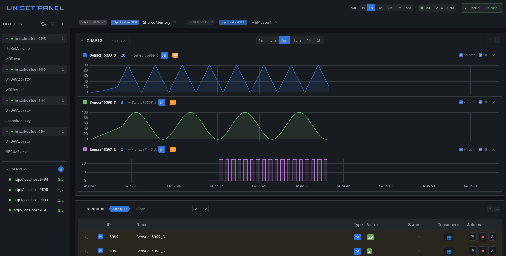
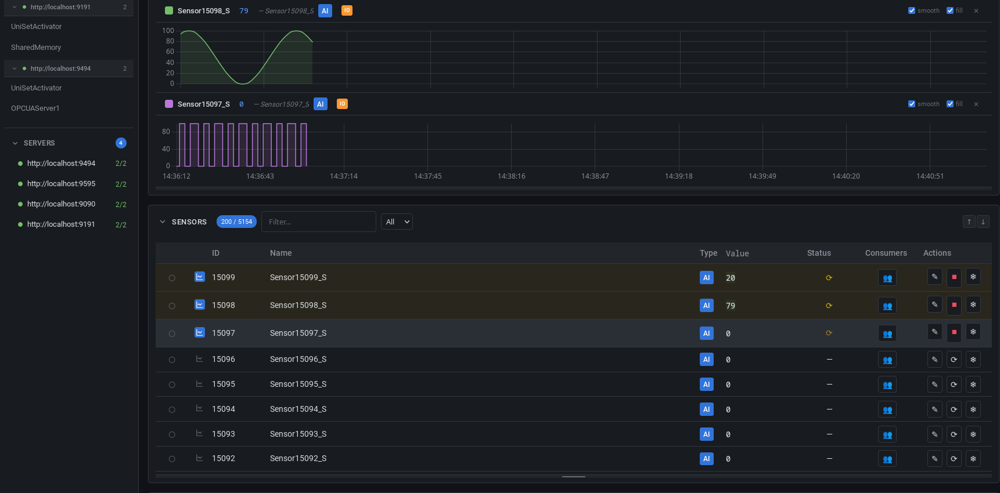
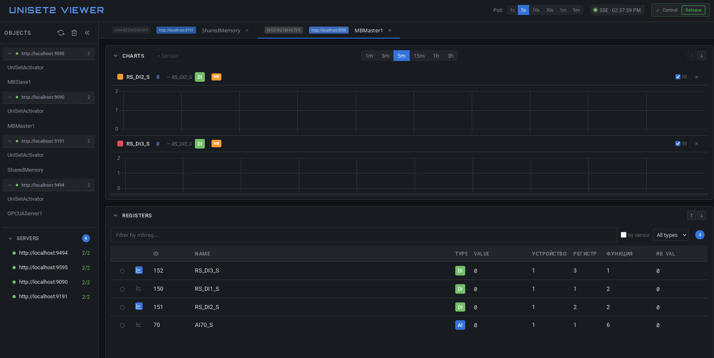
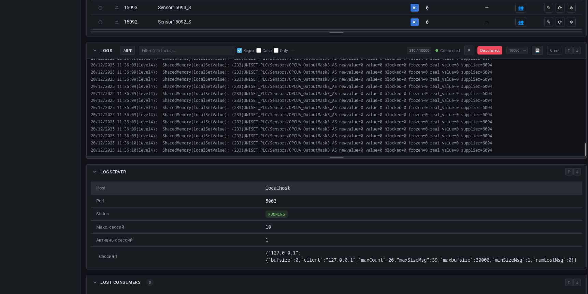

# uniset-panel

Веб-сервер для мониторинга состояния uniset2 процессов, отслеживания изменений внутренних переменных во времени с отображением графиков.

## Возможности

- Получение списка доступных uniset2 объектов
- Просмотр внутренних переменных объекта в реальном времени
- Графики для аналоговых и дискретных величин (Chart.js)
- Хранение истории: in-memory или SQLite
- Единый исполняемый файл (веб-ресурсы встроены через go:embed)
- Расширяемая система рендереров — разный интерфейс для разных типов объектов
- Collapsible секции (графики, IO, переменные, статистика и др.)
- Сохранение настроек UI в localStorage
- **LogServer клиент** — просмотр логов процесса в реальном времени
- **SSE (Server-Sent Events)** — получение обновлений данных без polling
- **Recording** — запись истории изменений в SQLite с возможностью экспорта

## Скриншоты

### Мониторинг с графиками


### Таблица сенсоров


### Modbus регистры


### LogServer


### Режимы управления
| Control mode | Read-only mode |
|:---:|:---:|
|  |  |

## Установка

```bash
go build -o uniset-panel ./cmd/server
```

## Запуск

```bash
./uniset-panel [опции]
```

### Параметры

| Параметр | По умолчанию | Описание |
|----------|--------------|----------|
| `--uniset-url` | `http://localhost:8080` | Адрес uniset2 HTTP API |
| `--port` | `8000` | Порт веб-сервера |
| `--poll-interval` | `5s` | Интервал опроса uniset2 |
| `--storage` | `memory` | Тип хранилища: `memory` или `sqlite` |
| `--sqlite-path` | `./history.db` | Путь к SQLite базе данных |
| `--history-ttl` | `1h` | Время хранения истории |
| `--log-format` | `text` | Формат логов: `text` или `json` |
| `--log-level` | `info` | Уровень логирования: `debug`, `info`, `warn`, `error` |
| `--uniset-config` | - | Путь к XML конфигурации UniSet2 (для имён датчиков) |
| `--recording-path` | - | Путь к файлу записи (включает Recording) |
| `--recording-enabled` | `false` | Запись включена по умолчанию |
| `--max-records` | `1000000` | Максимальное количество записей (циклический буфер) |

### Примеры

```bash
# Базовый запуск
./uniset-panel --uniset-url http://192.168.1.100:8080

# С SQLite хранилищем
./uniset-panel --uniset-url http://192.168.1.100:8080 --storage sqlite --sqlite-path /var/lib/uniset-viewer/history.db

# С кастомным интервалом опроса
./uniset-panel --uniset-url http://192.168.1.100:8080 --poll-interval 2s
```

## Архитектура

```
┌─────────────────────────────────────────────────────────────┐
│                      Browser (HTML/JS)                      │
│  ┌──────────────┐  ┌──────────────────────────────────────┐ │
│  │ Список       │  │ Вкладка объекта                      │ │
│  │ объектов     │  │ - таблица переменных                 │ │
│  │              │  │ - графики Chart.js                   │ │
│  └──────────────┘  └──────────────────────────────────────┘ │
└─────────────────────────────────────────────────────────────┘
                              │
                              ▼
┌─────────────────────────────────────────────────────────────┐
│                 uniset-panel (Go Server)               │
│  ┌─────────────┐  ┌─────────────┐  ┌─────────────────────┐  │
│  │ HTTP Server │  │ UniSet      │  │ Storage             │  │
│  │ (REST API)  │  │ Client      │  │ (memory/sqlite)     │  │
│  └─────────────┘  └─────────────┘  └─────────────────────┘  │
└─────────────────────────────────────────────────────────────┘
                              │
                              ▼
┌─────────────────────────────────────────────────────────────┐
│                  UniSet2 процессы (HTTP API)                │
│   /api/v2/list          - список объектов                   │
│   /api/v2/{Object}      - данные объекта                    │
│   /api/v2/{Object}/help - доступные команды                 │
└─────────────────────────────────────────────────────────────┘
```

## Структура проекта

```
uniset-panel/
├── cmd/server/main.go       # точка входа
├── internal/
│   ├── config/              # конфигурация
│   ├── uniset/              # HTTP клиент к uniset2
│   ├── storage/             # хранилище истории
│   ├── poller/              # периодический опрос
│   ├── api/                 # REST API сервера + SSE
│   ├── logger/              # structured logging (slog)
│   ├── logserver/           # TCP клиент к LogServer UniSet2
│   ├── sensorconfig/        # парсер XML конфигурации датчиков
│   └── recording/           # система записи истории в SQLite
├── ui/
│   ├── embed.go             # go:embed директивы
│   ├── static/              # JS, CSS
│   └── templates/           # HTML шаблоны
├── tests/                   # Playwright e2e тесты
├── go.mod
└── README.md
```

## LogServer

Для объектов с включённым LogServer (указан host и port в ответе API) доступен просмотр логов в реальном времени:

- Подключение через кнопку "Подключить" в секции "Логи"
- Выбор уровня логов (По умолчанию, CRIT, WARN+, INFO+, DEBUG+, ALL)
- Фильтрация по regexp
- Изменяемый размер окна (перетаскивание за нижнюю границу)
- Сворачивание секции

**Важно:** При выборе "По умолчанию" используются уровни логов, установленные в процессе. Для получения логов может потребоваться выбрать конкретный уровень.

## Recording

Система записи истории позволяет сохранять все изменения переменных в SQLite базу данных для последующего анализа и экспорта.

### Включение

```bash
# Включить recording с путём к файлу
./uniset-panel --recording-path ./recording.db

# Включить recording и запустить запись сразу
./uniset-panel --recording-path ./recording.db --recording-enabled
```

### UI управление

В header приложения появляется панель Recording:
- **Индикатор**: красная точка при активной записи
- **Badge**: количество записей и размер файла (например: `1.2M / 45MB`)
- **Record/Stop**: кнопка включения/выключения записи
- **Download**: выпадающее меню экспорта

### Экспорт

Доступные форматы экспорта:
- **SQLite Database (.db)** — копия файла базы данных
- **CSV Export (.csv)** — текстовый формат с разделителями
- **JSON Export (.json)** — структурированный JSON

### API

| Endpoint | Метод | Описание |
|----------|-------|----------|
| `/api/recording/status` | GET | Статус записи и статистика |
| `/api/recording/start` | POST | Запустить запись |
| `/api/recording/stop` | POST | Остановить запись |
| `/api/recording/clear` | DELETE | Очистить все записи |
| `/api/export/database` | GET | Скачать SQLite файл |
| `/api/export/csv` | GET | Экспорт в CSV |
| `/api/export/json` | GET | Экспорт в JSON |

### Циклический буфер

При достижении лимита записей (`--max-records`) автоматически удаляются самые старые записи:
- Проверка выполняется при каждом сохранении
- Удаляется 10% самых старых записей
- По умолчанию лимит 1 000 000 записей

## Лицензия

MIT
