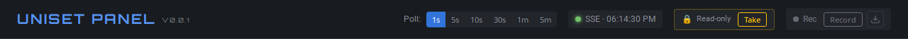
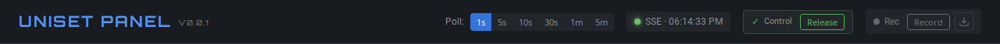
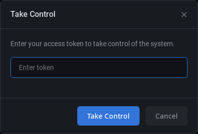

# Управление доступом (Session Control)

Система контроля доступа защищает write-операции (изменение значений датчиков, управление объектами) от конфликтов при одновременной работе нескольких пользователей.

## Принцип работы

- **Один активный контроллер**: Токенов может быть несколько, но в любой момент времени только один пользователь может иметь активный контроль
- **Токен-аутентификация**: Для получения контроля требуется валидный токен
- **Автоматическое освобождение**: Контроль освобождается при неактивности или отключении

## Режимы

### Read-only (по умолчанию)



В этом режиме пользователь может просматривать данные, но не может выполнять управляющие действия. Кнопки управления заблокированы.

### Control (активный контроль)



Пользователь с активным контролем может:
- Изменять значения датчиков
- Управлять freeze/unfreeze
- Запускать генераторы
- Отправлять команды LogServer

## Конфигурация

### Флаги командной строки

| Флаг | По умолчанию | Описание |
|------|--------------|----------|
| `--control-token` | - | Токен доступа (можно указать несколько раз) |
| `--control-timeout` | `60s` | Таймаут неактивности |

### Пример запуска

```bash
# С одним токеном
./uniset-panel --control-token secret123

# С несколькими токенами (разные уровни доступа)
./uniset-panel --control-token admin123 --control-token operator456

# С увеличенным таймаутом (5 минут)
./uniset-panel --control-token admin123 --control-timeout 5m
```

### Docker Compose

```yaml
services:
  viewer:
    image: uniset-panel
    command: >
      --control-token admin123
      --control-token operator456
      --control-timeout 60s
```

### YAML конфигурация

Токены можно указать в YAML конфиг-файле (`--config config.yaml`):

```yaml
# config.yaml
servers:
  - url: http://localhost:9090
    name: "Server 1"

control:
  tokens:
    - admin123
    - operator456
  timeout: 60s

ui:
  ioncUISensorsFilter: false
```

Запуск:
```bash
./uniset-panel --config config.yaml
```

**Приоритет**: Токены из CLI флагов добавляются к токенам из YAML файла (объединяются).

**Без токенов**: Если не указан ни один токен (ни в CLI, ни в YAML), система контроля отключена и все пользователи могут выполнять write-операции.

## Использование UI

### Взятие контроля

1. Нажмите кнопку **Take** в header
2. В диалоге введите токен доступа



3. Нажмите **Take Control**

При успешной авторизации индикатор изменится на зелёный "Control" с кнопкой "Release".

### Освобождение контроля

Нажмите кнопку **Release** для освобождения контроля. После этого вы перейдёте в режим Read-only.

### Автоматическое освобождение

Контроль автоматически освобождается в следующих случаях:

- **Таймаут неактивности**: Если нет активных действий в течение `--control-timeout`
- **Закрытие вкладки**: При закрытии браузера или вкладки
- **Потеря соединения**: При разрыве SSE соединения (с 3-секундным grace period для переподключения)

## API

### Endpoints

| Метод | Endpoint | Описание |
|-------|----------|----------|
| GET | `/api/control/status` | Получить текущий статус контроля |
| POST | `/api/control/take` | Взять контроль |
| POST | `/api/control/release` | Освободить контроль |
| POST | `/api/control/ping` | Keep-alive (продлить сессию) |

### Пример: взятие контроля

```bash
curl -X POST http://localhost:8000/api/control/take \
  -H "Content-Type: application/json" \
  -d '{"token": "admin123"}'
```

Ответ:
```json
{
  "enabled": true,
  "hasController": true,
  "isController": true,
  "timeoutSec": 60
}
```

### Пример: освобождение контроля

```bash
curl -X POST http://localhost:8000/api/control/release \
  -H "Content-Type: application/json" \
  -d '{"token": "admin123"}'
```

### Передача токена через URL

Токен можно передать через URL параметр для автоматического взятия контроля:

```
http://localhost:8000/?token=admin123
```

Токен будет сохранён в localStorage и удалён из URL для безопасности.

## Коды ошибок

| HTTP код | Описание |
|----------|----------|
| 200 | Успешно |
| 401 | Неверный токен |
| 403 | Нет контроля (для write-операций) |
| 409 | Контроль уже занят другой сессией |
