# Dashboards

Dashboards - система визуализации данных в реальном времени с гибким расположением виджетов на сетке.

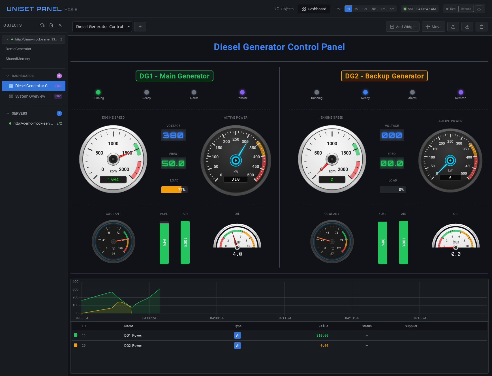

## Содержание

- [Начало работы](#начало-работы)
- [Импорт и экспорт](#импорт-и-экспорт)
- [Сетка и позиционирование](#сетка-и-позиционирование)
- [Режим редактирования](#режим-редактирования)
- [Виджеты](#виджеты)
  - [Gauge](#gauge)
  - [Level](#level)
  - [Digital](#digital)
  - [LED](#led)
  - [Label](#label)
  - [Divider](#divider)
  - [StatusBar](#statusbar)
  - [BarGraph](#bargraph)
  - [Chart](#chart)
- [Цветовые зоны](#цветовые-зоны)
- [Примеры](#примеры)

---

## Начало работы

### Переключение на Dashboard

1. Нажмите кнопку **Dashboard** в заголовке страницы
2. Выберите дашборд из списка слева или из выпадающего меню

### Создание нового дашборда

1. Нажмите кнопку **"+"** рядом с выпадающим списком дашбордов
2. Введите название и описание
3. Настройте сетку (количество колонок, высота строки, отступы)
4. Нажмите **Create**

---

## Импорт и экспорт

### Экспорт дашборда

1. Выберите дашборд из списка
2. Нажмите кнопку **Export** в тулбаре
3. Файл `dashboard-name.json` будет скачан в папку загрузок

Экспортированный файл содержит полную конфигурацию дашборда и может быть:
- Сохранён как резервная копия
- Передан другим пользователям
- Отредактирован вручную в текстовом редакторе
- Размещён на сервере в `config/dashboards/`

### Импорт дашборда

1. Нажмите кнопку **Import** в тулбаре
2. Выберите JSON файл с дашбордом
3. Дашборд появится в списке

**Особенности импорта:**
- Если дашборд с таким именем уже существует, он будет перезаписан
- Импортированные дашборды сохраняются в localStorage браузера
- Для общего доступа разместите файл в `config/dashboards/` на сервере

### Серверные дашборды

Дашборды можно размещать на сервере в директории `config/dashboards/`.

**Преимущества серверных дашбордов:**
- Доступны всем пользователям
- Не зависят от localStorage браузера
- Помечены как "server" в списке
- Не могут быть удалены через UI (только редактирование файла)

---

## Сетка и позиционирование

Дашборд использует CSS Grid для размещения виджетов.

### Параметры сетки

- **Columns (cols)**: Количество колонок. По умолчанию 48 - позволяет гибко делить на 2, 3, 4, 6, 8, 12, 16, 24 части.
- **Row Height**: Высота одной строки в пикселях (по умолчанию 30px)
- **Gap**: Отступ между виджетами (по умолчанию 4px)

### Позиционирование виджета

В диалоге настроек виджета доступны поля:
- **Col** / **Row** - начальная позиция (0-based)
- **Width** / **Height** - размер в ячейках сетки
- **Offset X** / **Offset Y** - точная подстройка позиции в пикселях

### Пример расчёта размера

При `rowHeight: 30` и `gap: 4`:
- Виджет с `height: 9` = 9 × 30 + 8 × 4 = 302px
- Виджет с `width: 10` при 48 колонках = ~20% ширины

---

## Режим редактирования

### Включение режима

Нажмите кнопку **Move** в тулбаре дашборда.

### Возможности в режиме редактирования

На каждом виджете появляются кнопки:
- **⚙** (Config) - открыть настройки виджета
- **🗑** (Delete) - удалить виджет
- Drag - перемещение виджета мышью

### Добавление виджета

1. Нажмите **Add Widget** в тулбаре
2. Выберите тип виджета из списка
3. Настройте параметры в диалоге
4. Нажмите **Apply**

### Перемещение виджетов

1. Включите режим **Move**
2. Перетащите виджет за область заголовка
3. Отпустите в новой позиции

### Поворот виджета

В настройках виджета (⚙) доступны кнопки поворота на 90° влево/вправо.

---

## Виджеты

### Gauge

Стрелочный индикатор для отображения аналоговых значений.

| Стиль | Описание | Скриншот |
|-------|----------|----------|
| `speedometer` | Белый спидометр с дугой | 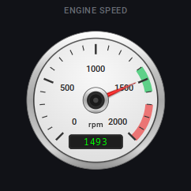 |
| `dual` | Двухшкальный (основное + целевое значение) |  |
| `arc270` | Чёрный с дугой 270° | 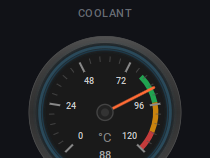 |
| `semicircle` | Классический полукруглый | 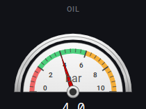 |

**Диалог настроек:**

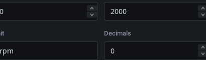

**Настройки:**

| Параметр | Описание |
|----------|----------|
| `sensor` | Имя датчика |
| `sensor2` | Второй датчик (только для dual style) |
| `label` | Подпись |
| `style` | Стиль отображения |
| `min` / `max` | Диапазон шкалы |
| `unit` | Единица измерения (°C, %, bar и т.д.) |
| `decimals` | Количество знаков после запятой |
| `zones` | Цветовые зоны (см. [Цветовые зоны](#цветовые-зоны)) |

---

### Level

Индикатор уровня (вертикальный или горизонтальный).

| Ориентация | Скриншот |
|------------|----------|
| Vertical | 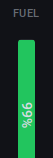 |
| Horizontal | 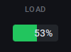 |

**Диалог настроек:**

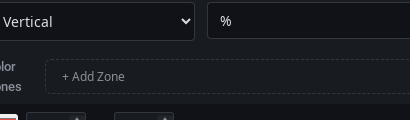

**Настройки:**

| Параметр | Описание |
|----------|----------|
| `sensor` | Имя датчика |
| `label` | Подпись |
| `min` / `max` | Диапазон |
| `unit` | Единица измерения |
| `orientation` | `vertical` или `horizontal` |
| `zones` | Цветовые зоны (см. [Цветовые зоны](#цветовые-зоны)) |

**Пример использования:** индикатор уровня топлива, давления воздуха, нагрузки.

---

### Digital

Цифровой дисплей в стиле семисегментного индикатора.

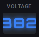

**Диалог настроек:**

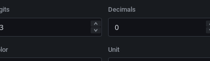

**Настройки:**

| Параметр | Описание |
|----------|----------|
| `sensor` | Имя датчика |
| `label` | Подпись (V, Hz, A и т.д.) |
| `digits` | Количество цифр (3-6) |
| `decimals` | Знаков после запятой |
| `color` | Цвет цифр |

---

### LED

Светодиодный индикатор вкл/выкл.

**Настройки:**

| Параметр | Описание |
|----------|----------|
| `sensor` | Имя датчика |
| `label` | Подпись |
| `threshold` | Порог срабатывания (значение > threshold = ON) |
| `onColor` | Цвет во включённом состоянии |
| `offColor` | Цвет в выключенном состоянии |
| `errorColor` | Цвет при ошибке |
| `blinkOnError` | Мигать при ошибке |

---

### Label

Статическая текстовая метка или заголовок.

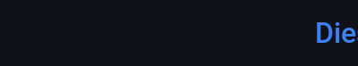

**Настройки:**

| Параметр | Описание |
|----------|----------|
| `text` | Текст |
| `fontSize` | Размер: `small`, `medium`, `large`, `xlarge` |
| `color` | Цвет текста |
| `align` | Выравнивание: `left`, `center`, `right` |
| `border` | Показать рамку (nameplate) |
| `borderColor` | Цвет рамки |
| `borderWidth` | Толщина рамки |
| `borderRadius` | Скругление углов |
| `backgroundColor` | Цвет фона |

---

### Divider

Разделительная линия (горизонтальная или вертикальная).

**Диалог настроек:**

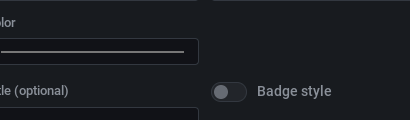

**Настройки:**

| Параметр | Описание |
|----------|----------|
| `orientation` | `horizontal` или `vertical` |
| `color` | Цвет линии |
| `thickness` | Толщина в пикселях |
| `style` | `solid`, `dashed`, `dotted` |
| `margin` | Отступы от краёв |

---

### StatusBar

Панель статусных индикаторов (несколько LED в ряд).

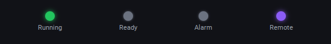

**Диалог настроек:**

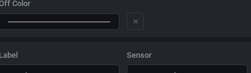

**Настройки:**

| Параметр | Описание |
|----------|----------|
| `layout` | `horizontal` или `vertical` |
| `items` | Массив индикаторов |

Каждый элемент в `items` содержит:
- `label` - подпись индикатора
- `sensor` - имя датчика
- `threshold` - порог срабатывания
- `onColor` / `offColor` - цвета состояний

---

### BarGraph

Столбчатая диаграмма для нескольких значений.

**Настройки:**

| Параметр | Описание |
|----------|----------|
| `layout` | `horizontal` или `vertical` |
| `min` / `max` | Диапазон |
| `items` | Массив столбцов |

Каждый элемент в `items` содержит:
- `label` - подпись
- `sensor` - имя датчика
- `color` - цвет столбца

---

### Chart

График временных рядов с поддержкой нескольких датчиков.

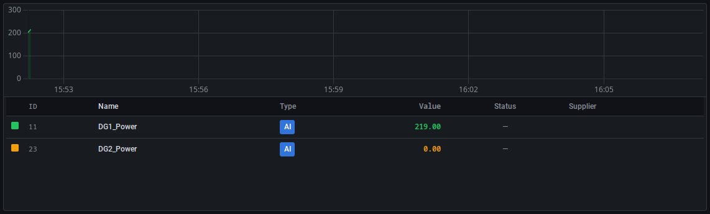

**Диалог настроек:**

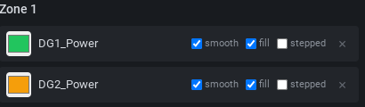

**Настройки:**

| Параметр | Описание |
|----------|----------|
| `label` | Заголовок графика |
| `showTable` | Показать таблицу значений |
| `tableHeight` | Высота таблицы в пикселях |
| `transparent` | Прозрачный фон |
| `zones` | Группы датчиков |

Для добавления датчиков на график:
1. Откройте настройки виджета Chart
2. Введите имя датчика в поле автодополнения
3. Выберите цвет линии
4. Включите/выключите заливку под графиком
5. Нажмите Apply

---

## Цветовые зоны

Цветовые зоны позволяют визуально выделять диапазоны значений на виджетах Gauge и Level.

### Создание зон в диалоге настроек

1. Откройте настройки виджета (⚙)
2. Найдите секцию **Zones**
3. Нажмите **Add Zone**
4. Укажите:
   - **From** - начало диапазона
   - **To** - конец диапазона
   - **Color** - цвет зоны (выбор из палитры или HEX-код)
5. Добавьте дополнительные зоны при необходимости
6. Нажмите **Apply**

### Рекомендации по зонам

**Для температуры:**
- Зелёный (норма): 80-95°C
- Жёлтый (предупреждение): 95-110°C
- Красный (опасность): 110-120°C

**Для уровня топлива:**
- Красный (критично): 0-15%
- Жёлтый (низкий): 15-30%
- Зелёный (норма): 30-100%

**Для нагрузки:**
- Зелёный (норма): 0-70%
- Жёлтый (высокая): 70-85%
- Красный (перегрузка): 85-100%

### Стандартные цвета

| Цвет | HEX | Назначение |
|------|-----|------------|
| Зелёный | `#22c55e` | Норма, безопасно |
| Жёлтый | `#f59e0b` | Предупреждение |
| Красный | `#ef4444` | Опасность, ошибка |
| Синий | `#3b82f6` | Информация |
| Фиолетовый | `#8b5cf6` | Специальный статус |
| Серый | `#6b7280` | Неактивно, выключено |

---

## Общие настройки виджетов

Все виджеты поддерживают:

| Параметр | Описание |
|----------|----------|
| `title` | Заголовок виджета |
| `titleBorder` | Показать заголовок как badge |
| `transparent` | Прозрачный фон виджета |

---

## Примеры

### Diesel Generator Dashboard

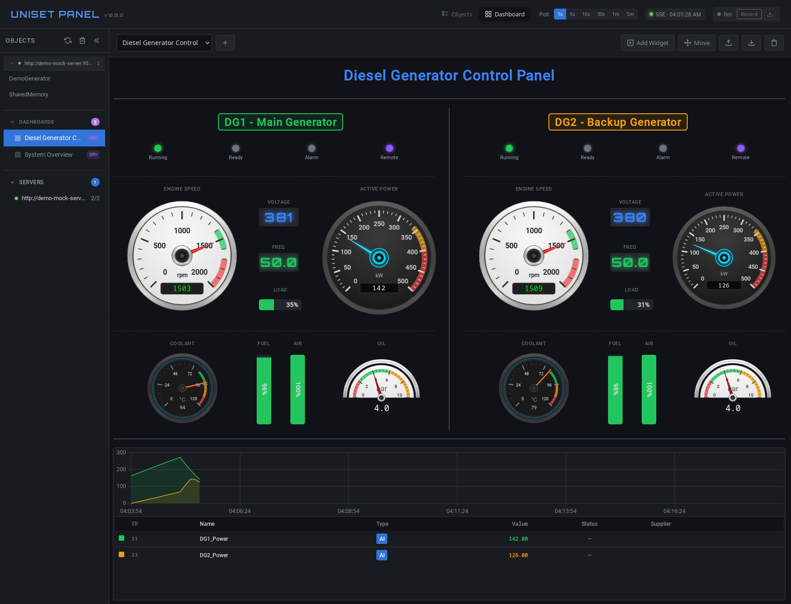

Дашборд для мониторинга двух дизель-генераторов включает:

- **Gauge (speedometer)** - обороты двигателя (RPM)
- **Gauge (dual)** - активная мощность (Power)
- **Gauge (arc270)** - температура охлаждающей жидкости
- **Gauge (semicircle)** - давление масла
- **Level (vertical)** - уровень топлива и давление воздуха
- **Level (horizontal)** - нагрузка (Load)
- **Digital** - напряжение и частота
- **StatusBar** - статус (Running, Ready, Alarm, Remote)
- **Label** - заголовки секций
- **Divider** - разделители
- **Chart** - график мощности

---

## Советы

1. **Используйте сетку 48 колонок** - легко делить на любое количество секций
2. **Группируйте связанные виджеты** - используйте Label и Divider для структуры
3. **Цветовые зоны** - помогают быстро оценить состояние
4. **Offset** - используйте для точной подстройки позиции
5. **Прозрачность** - `transparent: true` для более чистого вида
